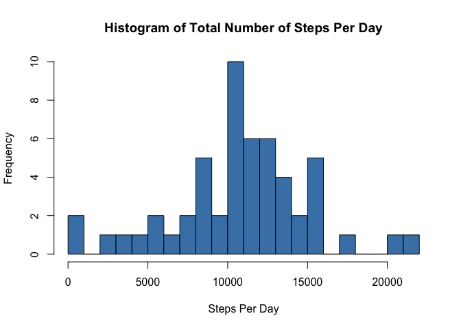
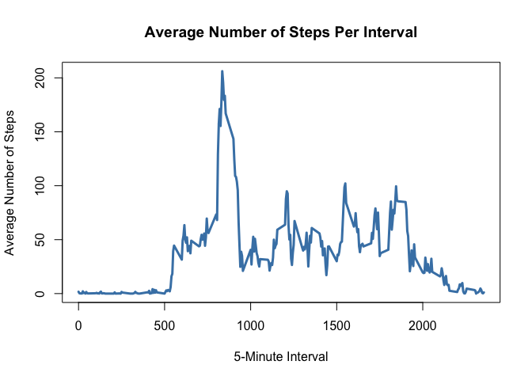
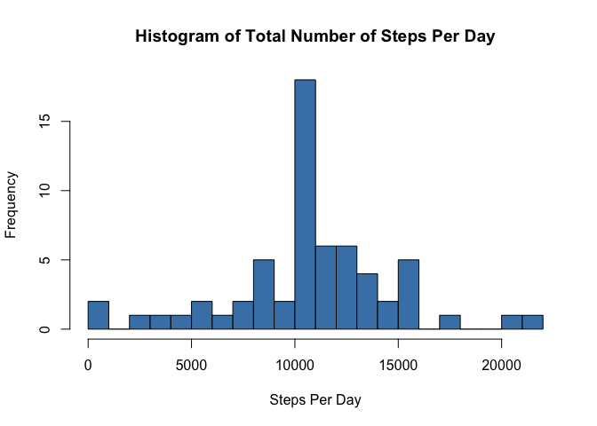
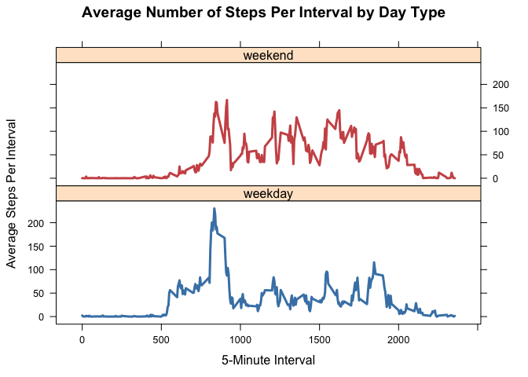

# Reproducible Research: Peer Assessment 1
Brandon Kopp  
January 7, 2016  

###Load Libraries


```r
suppressMessages(library(dplyr))
suppressMessages(library(lattice))
```

##Loading and preprocessing the data

This part of the script

1. Downloads the data
2. Loads the data into an object named "act"


```r
if (!file.exists("./data")){
  dir.create("./data")
}

fileURL <- "https://d396qusza40orc.cloudfront.net/repdata%2Fdata%2Factivity.zip"
download.file(fileURL,destfile="./data/ActMon.zip", method="curl")

dateDownloaded <- date()
dateDownloaded
```

```
## [1] "Thu Jan  7 18:56:36 2016"
```

```r
act <- read.csv(unz("./data/ActMon.zip", "activity.csv"), header=T, stringsAsFactors = FALSE)
```

##What is mean total number of steps taken per day?

1. Calculate the total number of steps taken per day


```r
stepsperday <- act %>% 
  group_by(date) %>%
  summarize(steps = sum(steps))
head(stepsperday)
```

```
## Source: local data frame [6 x 2]
## 
##         date steps
##        (chr) (int)
## 1 2012-10-01    NA
## 2 2012-10-02   126
## 3 2012-10-03 11352
## 4 2012-10-04 12116
## 5 2012-10-05 13294
## 6 2012-10-06 15420
```

```r
tail(stepsperday)
```

```
## Source: local data frame [6 x 2]
## 
##         date steps
##        (chr) (int)
## 1 2012-11-25 11834
## 2 2012-11-26 11162
## 3 2012-11-27 13646
## 4 2012-11-28 10183
## 5 2012-11-29  7047
## 6 2012-11-30    NA
```

2. Make a histogram of the total number of steps taken each day


```r
hist(stepsperday$steps,breaks = 25,main = "Histogram of Total Number of Steps Per Day",
     xlab="Steps Per Day", col="steelblue")
```

 

3. Calculate and report the mean and median of the total number of steps taken per day


```r
mean(stepsperday$steps, na.rm=TRUE)
```

```
## [1] 10766.19
```

```r
median(stepsperday$steps, na.rm=TRUE)
```

```
## [1] 10765
```

* __The mean total number of steps taken per day is 10766__

##What is the average daily activity pattern?

1. Make a time series plot (i.e. 𝚝𝚢𝚙𝚎 = "𝚕") of the 5-minute interval (x-axis) and the average number of steps taken, averaged across all days (y-axis)


```r
stepsperinterval <- act %>% 
  group_by(interval) %>%
  summarize(steps= mean(steps, na.rm=TRUE))

plot(stepsperinterval$interval, stepsperinterval$steps, type = "l", lwd=3, col="steelblue", xlab="5-Minute Interval", ylab="Average Number of Steps",main="Average Number of Steps Per Interval")
```

 


2. Which 5-minute interval, on average across all the days in the dataset, contains the maximum number of steps?


```r
stepsperinterval[which.max(stepsperinterval$steps), ][[1]]
```

```
## [1] 835
```

* __The 5-minute interval with the highest average number of steps is 835 or 8:35 AM__

##Imputing missing values

1. Calculate and report the total number of missing values in the dataset (i.e. the total number of rows with 𝙽𝙰s)


```r
summary(act$steps)["NA's"]
```

```
## NA's 
## 2304
```

2. Devise a strategy for filling in all of the missing values in the dataset. The strategy does not need to be sophisticated.


```r
stepsperinterval <- act %>% 
  group_by(interval) %>%
  summarize(steps= mean(steps, na.rm=TRUE))
```

* __I chose to calculate the average steps by interval number and use that for missing values__

3. Create a new dataset that is equal to the original dataset but with the missing data filled in.


```r
act2 <- act
act2 <- full_join(act2, stepsperinterval, by='interval')
act2[is.na(act2$steps.x) ==TRUE, ][1] <- act2[is.na(act2$steps.x) ==TRUE, ][4]
act2 <- act2[ ,1:3]
names(act2)[1] <- "steps"
```

4. Make a histogram of the total number of steps taken each day and Calculate and report the mean and median total number of steps taken per day. Do these values differ from the estimates from the first part of the assignment? What is the impact of imputing missing data on the estimates of the total daily number of steps?


```r
stepsperday <- act2 %>% 
  group_by(date) %>%
  summarize(steps = sum(steps))

hist(stepsperday$steps,breaks = 25,main = "Histogram of Total Number of Steps Per Day",
     xlab="Steps Per Day", col="steelblue")
```

 

```r
mean(stepsperday$steps, na.rm=TRUE)
```

```
## [1] 10766.19
```

```r
median(stepsperday$steps, na.rm=TRUE)
```

```
## [1] 10766.19
```

* __These values are roughly the same as the previous values.__
  + __Mean: Old - 10766.19  New - 10766.19__
  + __Median: Old - 10765  New - 10766.19 __
* __There is little to no effect of imputing the missing values in terms of mean and median. Though the distribution in the histogram is a bit different, with a greater peak at the mean.__

##Are there differences in activity patterns between weekdays and weekends?

1. Create a new factor variable in the dataset with two levels – “weekday” and “weekend” indicating whether a given date is a weekday or weekend day.


```r
act2$weekday[weekdays(as.Date(act2$date)) %in% c("Saturday","Sunday")] <- "weekend"
act2$weekday[weekdays(as.Date(act2$date)) %in% c("Monday","Tuesday","Wednesday","Thursday","Friday")] <- "weekday"

act2$weekday <- as.factor(act2$weekday)
```

2. Make a panel plot containing a time series plot (i.e. 𝚝𝚢𝚙𝚎 = "𝚕") of the 5-minute interval (x-axis) and the average number of steps taken, averaged across all weekday days or weekend days (y-axis). 


```r
stepsperinterval <- act2 %>% 
  group_by(interval, weekday) %>%
  summarize(steps = mean(steps, na.rm=TRUE))

xyplot(steps~interval|weekday, data=stepsperinterval, group = weekday, type="l", layout=c(1,2), lwd=3, col=c("steelblue","indianred3"),  xlab="5-Minute Interval", ylab="Average Steps Per Interval", main="Average Number of Steps Per Interval by Day Type")
```

 

* __There are interesting differences in activity patterns.__
* __Weekend days start later and end later.__
* __There is more movement during the middle of the day on the weekend.__
